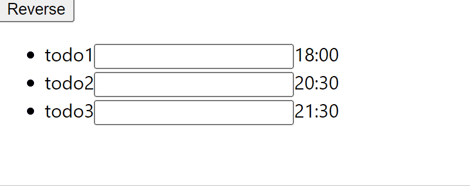
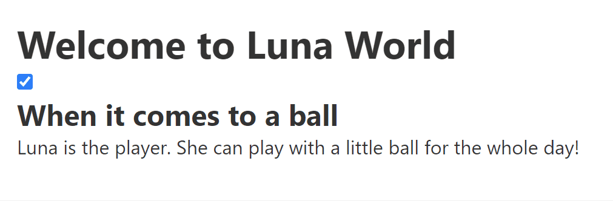
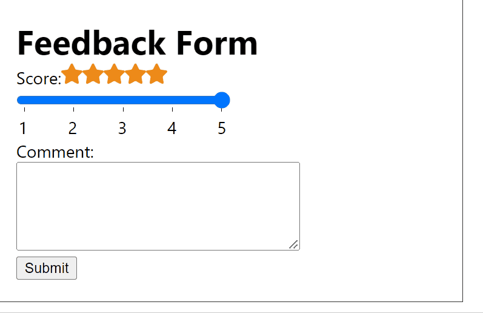
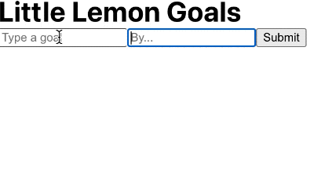
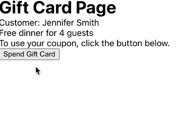

# 100 Days Of Code - Log

### Day 1: August 15, Monday

**Today's Progress**: Understood what is Unit testing and why we need to do testing.

- Unit testing: Testing the smallest units of code in isolation (fast)
- Why we test codes: To make sure a software behaves as expected

**Thoughts:** What I'm learning is the basic concepts. I feel a bit in rush wanting to do code exercises but it is okay to spend time in learning the concepts without actually coding as long as I'm learning something new!

---

### Day 2: August 16, Tuesday

**Today's Progress**: Reviewed the concept of a prototype object, inheritance with the construction of classes. Understand what data structure is and why we need to talk about it.

- Data Structure: it is about how to store data so that it can be used efficiently in completing a certain type of task. (Object, Array, Map, Set, etc.)
- 'Map' data structure example:
  <pre><code>//👍 Easy to access, remove, add on
  const contacts = new Map()
  contacts.set('Jessie', {phone: "213-555-1234", address: "123 N 1st Ave"})
  contacts.has('Jessie') // true
  contacts.get('Hilary') // undefined
  contacts.delete('Jessie')
  contacts.size // 0
  </code></pre>
- 'Set' data structure example:
  <pre><code>//👍 Easy to filter out duplicate array items
  const repetitiveFruits = ['apple','pear','apple','pear','plum', 'apple'];
  const uniqueFruits = new Set(repetitiveFruits);
  console.log(uniqueFruits); // {'apple', 'pear', 'plum'}
  </code></pre>

**Thoughts:** Trying to experience the value of reviewing the basic concepts to retain them. It is interesting to see how many new things I get to see with fresh eyes while going over the content I learned two weeks ago.

---

### Day 3: August 17, Wednesday

**Today's Progress**: I've gone through two mini exercises about event handler and DOM manipulation.

**Thoughts** I realized however easy the exercise looks, I must try coding it from beginning to end by myself at least once.

**Link(s) to work**
[eventHandling_01](/exercises/eventHandling/eventHandling_01.js)
[eventHandling_02](/exercises/eventHandling/eventHandling_02.js)

---

### Day 4: August 18, Thursday

**Today's Progress**

- Completed one mini exercise about event handler
- Reviewed JSON:
  - JSON is a subset of JavaScript.
  - JSON can be a data format but also a file.
  - Strings & Keys must be double-quoted.
  - Functions(methods) cannot be included (silently ignored).
  - It can be objects or **arrays**.

**Thoughts** I realized that taking it slow is very important in learning the new concepts.

**Link(s) to work**
[eventHandling_03](/exercises/eventHandling/eventHandling_03.js)

---

### Day 5: August 19, Friday

**Today's Progress**

- Learned how to implement Jest for unit testing.
- Completed the final assignment of the JavaScript course [Programming with JavaScript taught by Meta, @Coursera](https://www.coursera.org/learn/programming-with-javascript)
  - Coded a logic for a simple receipt maker using loop and if statements.
  - Learned the basic concept of defensive programming.
    - You should think about what to display when the arguments are not passed in or invalid...etc.
    - Implement test-driven development(TDD). Red Green Refactor cycle (test code -> programming -> test -> refactor -> test)

**Thoughts** Although I completed another course of this Meta Front-end developer series, I don't feel confident and this is a natural feeling. I just feel happy that I could learn what I want to learn and I just love the composed state of mind when I'm in coding mode. Let's continue till I cannot physically do it!😊

---

### Day 6: August 20, Saturday

**Today's Progress**

- Started the next Coursera course, [Version Control taught by Meta, @Coursera](https://www.coursera.org/learn/introduction-to-version-control)
- Learned the importance of effective collaboration to work in a development team
- Some lessons learned are:
  - Try to write smaller changes so that you can easily revert them.
  - Along with VCS, workflow is important for the quality and efficiency. We need a procedure (I understood it as a protocol, imagine a diagram).
  - Continuous Integration (CI): small changed merged frequently

**Thoughts** I feel a bit intimidated with terminologies but I tried to stay open and positive about this new concepts. Also, it seems like communication can be improved by clearly taking a note on each change. Finally, I will practice **'ruthlessly prioritizing tasks'** and differentiate which is important amongst endless flow of tasks.

---

### Day 7: August 21, Sunday

**Today's Progress**

- Learned basics of Unix Commands: cd, ls, ls -a, ls -l, pwd, mv, mkdir, touch
- Didn't fully get; **cat, cp, vi, vim, less, grep, redirection, pipe**

**Thoughts** I felt a bit bored with using command lines but at the same time I feel like this is a type of hurdle I need to jump over to become a great developer.

---

### Day 8: August 22, Monday

**Today's Progress**

- Learned Git and Github
  - What I didn't understand in 'branch': **git push -u origin feature/lesson** is where it'll come in with a **pull request for peer review**. I got it. However, the teacher said using **-u** means that I'm only going to get updates from the upstream and the result is 'feature/lesson' becoming the **origin**. I need to understand this part better.

**Thoughts** I now understand when (in what context) the (merge) conflict can happen. It's either when I pull or I push. If there's no conflict, it'll automerge. Ah-ha!😊

---

### Day 9: August 23, Tuesday

**Today's Progress**

- Scenario: I and My coworker J both perform **git pull** to get started.

1. I create a new branch called feature/myTest **git checkout -b feature/myTest** and commit the new code.
2. I perform **git pull origin main** to check if there is change in the main branch.
3. I type **git push -u origin feature/myTest**
4. My coworker J is still working on his new branch called feature/myTest2.
5. He now performs **git pull**.
6. He's prompted with a merge conflict message.
7. After him and I discuss the conflict issue, he fixes code, add & commit the change, and push **git push -u origin feature/myTest2**

**Thoughts** I started to feel more comfortable about using git commands. I got the hang of the conflict resolvement process! This feels awesome!!!😊

---

### Day 10: August 24, Wednesday

**Today's Progress**

- Learned **HEAD, git diff, git blame**

  - **git diff HEAD README.md** ==> Shows the change between the current working tree status and the last commit
  - **git log --pretty=oneline** ==> Shows the recent commits with its full ID
  - **git diff ID1 ID2** ==> Shows the change between these two commits
  - **git blame README.md** ==> Shows all the changes
  - **git blame -L 5,15 README.md** ==> Shows the specified scope of lines
  - **git blame -l README.md** ==> Commit ID shows in full

- Common way of using git blame and git commit
  - 1. Get the ID of the commit with git blame README.md
  - 2. See the full log of the commit with git log -p 8digits

**Thoughts**
I hope I can truly understand why those commits are helpful later by joining an open source project!!

---

### Day 11: August 25, Thursday

**Today's Progress**

- Learned **Forking**: It is useful when I want to contribute to the other developer's project without directly affecting it. It gives more control to the owner of the original repo.
- Forking Workflow
  1. Fork and copy the original repo to my remote repo.
  2. Clone it to my local repo.
  3. Create a new branch (my-branch).
  4. After making some changes, perform git add & commit
  5. Push the local repo (branch) to my remote repo wit **git push origin my-branch**
  6. Go to Github and create a new pull requset (PR)
  7. Click 'compare across forks' link.
  8. Choose the main branch for the original repo and the my-branch for my repo.

**Thoughts**
I cannot wait to join some open source project someday!

---

### Day 12: August 26, Friday

**Today's Progress**

- Completed the Version Control Course by Meta.
- The concepts I need to learn practical usages of;
  1. git log, git diff, git blame
  2. redirection, pipe
  3. forking and contributing to open sources
- Started HTML and CSS in Depth by Meta.
  1. Learend **well-structured web pages** are the key for greate websites to support accessibility and SEO.
  2. Semantic tags to add meanings to the content of the web pages.
  3. Some semantic tags requires the inclusion of the other tags: e.g. **section tag requires a heading in it**.
  4. **artical** tag is versatile. As long as it is independently distributable, I can wrap it in article.
  5. Ask 'where to'? A heading inside of a section? A heading directly under a main?

**Thoughts**
I already learned a lot about the tags. I thought I knew enough but I didn't. There are so much to learn. Stay humble and enjoy this journey! Imagine how cool websites you can create in the future!

---

### Day 13: August 27, Saturday

**Today's Progress**

- Learned the importance of **Meta tags** for search engine optimization(SEO).
- SEO: the process of making improvements to a website's content, semantics, and delivery to improve its ranking in search results.
- Based on the results of the analysis and the content on your website, the search engine will rank the website for various **search terms**.
- View port metadata is important for the user experience and it's also important for search engine optimization. This is because **many search engines now include websites mobile experience as a part of their ranking algorithms**.
- Learend the importance of having a **Template** to be able to start new projects faster.

**Haven't fully understood**

- meta http-equiv="..." tags: The instructor said "This is rare to see, and it’s recommended to use HTTP headers over HTML http-equiv meta tags."

**Thoughts**
I love learning the html in a deeper level. Can't wait to apply all these knowledge in the near future.

---

### Day 14: August 28, Sunday

**Today's Progress**

- Learned why **social media cards** are important and how **Open Graph Protocol(OGP)** works.
- Quote of the day!! **User attention is currency.** A caption and image can drive users towards or away from a website.
  - For a regular user scrolling through social media, the link provided with the image preview has only one chance and a moment’s attention to make a good impression. In such cases, the role of social media cards becomes very important.
- Another great tip! **the social media cards also play an important role in boosting the rankings for the web crawlers used by search engines.**

**Thoughts**
So happy to finally understand why the other business social media were adding website links to their account's timeline!!!

---

### Day 15: August 29, Monday

**Today's Progress**

- Learned **Input and Form**
- label tag is associated with the input field for accessibility and better user experience. (the 'for' attribute in label tag and the 'id' in input tag)
- When submitting a form, you can use a button tag with type of submit attribute.

**Thoughts**
It was refreshing to learn the basics of input and form. I now feel more comfortable and confident about creating a form.

---

### Day 16: August 30, Tuesday

**Today's Progress**

- Reorganize my understanding of **label** tag. There are two cases when we want to use it.

1. When I want to simply wrap an input field when bare text is sitting ont the right side of the field (e.g. radio options).
2. When I want to add the descriptive text right before the input tag for a better user experience. This requires 'for'(in label) and 'id'(in input) association.

- Learned **datalist** tag. It works together with input tag since datalist contains just the text data.
  - Datalist is useful when we want to allow users to select the option or type the option.
  - It is also useful when there's a chance to add options later on.
  - Interestingly, the input tag doesn't have 'type' attribute for the datalist implementation.
- Finally understood why sometimes we want to use 'fieldset' tag. It is only when there needs a clear way to group options as in radio inputs.
- radio inputs' **name** attributes should associate with the **id** value of the fieldset.

> We expect users to abide by rules. But, Humans are prone to errors. It's our job to ensure the shape of the data we expect in each field is correct.
> I also noticed that the **'name' attribute is almost always used** and I'll keep an eye on it. This is to send data in key/value pair later on.

**Thoughts**
Absolutely loved what I learned today. I finally feel comfortable about using form tags. This is the gift of being consistent in learning Front-end basics!

---

### Day 17: August 31, Wednesday

**Today's Progress**
Learned how to submit form data to a server.

1. form tag can have ==> action='/login', method='POST'
2. Full URL vs. absolute path vs. relative path

- If action attribute is not specified, the current page url will be used.
- If I'm on the 'https://wonmikwon.com/profile and I submit the form that has '/login', it will send a request to 'https://wonmikwon.com/login'
  That is, the absolute path is appended to the base URL of the website.

**Thoughts**
Not directly related to the subject (HTTP), but it was great to review how absolute/relative paths work.

---

### Day 18: September 1, Thursday

**Today's Progress** Reviewed some confusing input attributes and form tags

- min, max: works for numerical inputs such as number, range, and date
- minlength, maxlength: works for a length of a text iput
- Elements that I need to work on more: select, datalist
- fieldset is used with a set of radio input options. It also groups multiple inputs (first name and last name.)
- 'input type=submit' vs. 'button type=submit' => the type must be specified for a submission behavior.

**Thoughts**
I should not forget a 'name' attribute!

---

### Day 19: September 2, Friday

**Today's Progress** Reviewed 'audio' and 'video' tags

- It was insightful to learn that iframe element should be used only when you can trust the website 100% since it is very vulnerable to malitious security attacks. (There is a way to prevent it to some extent but there's still a chance to get attacked.)
- Used input type='range' and datalist together. I got the hang of the associatation of input's list attribute and datalist's id attribute.

**Thoughts**
I love being able to experience each element one by one in depth. Love this course!

---

### Day 20: September 3, Saturday

**Today's Progress**

- iframe: Learned how to minimize security vulnerability concerns of using iFrame.
  - Use 'allow' attribute to limite the broswer features such as camera, microphone, API, geolocation, etc.
  - User 'sandbox' attribute to set restrictions to the actions such as downloading a file, popup, modal, running JavaScript, etc.
- Canvas: useful when embedding animated graphics (controlled with JavaScript logic!)

**Thoughts**
I wonder how much detail of Canvas I need to know and be able to create the graphics.

---

### Day 21: September 4, Sunday

**Today's Progress**
Learned the basics of flexbox

- Flexbox is single-dimensional. Repeat!! Flexbox is single-dimensional.
- Common use case A: Creating responsive columns in a single row that doesnt change into multiple lines. (Navigation, Searh bar, Main Content of Coursera desktop view)
- Common use case B: Binding a group of items that will change from one row to multiple rows according to the window size.

Refreshing concepts:

- flex-flow: set the direction and wrap/nowrap at the same time.
- flex-direction: if set to 'column' it means the main axis changes. Just like it rotates -90 degrees
  If this happens, the justify-content and align items properties get to switch their roles.

**Thoughts**
I'm very happy that I finally feel like I get the practical usage of flexbox. However, I still need to really get it by coding by myself. Do not skip to the next part until I actually get to practice coding each example in the lesson!!

---

### Day 22: September 5, Monday

**Today's Progress**

- align-items vs. align-content: align-items is for what's happening in each row, whereas align-content is what's happening to the group of rows in the flex container.
- flex: a shorthand property applied to flex items.
  - flex-grow: 0 (Usually set not to take up the available space)
  - flex-shrink: 1 (Usually set to shrink if necessary, like when the window gets narrower)
  - flex-basis: auto (Usually set to percentage. It defines the starting size of the item. If the flex-grow set to 1, it means, the size of the element will grow as the window size grows and keeping the percentage ratio.)

**Thoughts**
I finally, I feel more confident about flex. I'm looking forward to creating a chart using flexbox.

---

### Day 23: September 6, Tuesday

**Today's Progress**

- CSS grid: It is common to have 12 or 16 track columns when using CSS grid.
- Using **grid-column** property to a grid child, we can specify the starting column and spanning columns.
- Using **grid-auto-rows** or **grid-auto-columns**, with **fraction unit (fr)**, we can make the grid easier to modify.

**Thoughts**
Still feeling like I'm very new to Grid. I need more practical exercises.

---

### Day 24: September 7, Wednesday

**Today's Progress**

- **grid-template-areas** in the container and **grid-area** when I want to assign each element to a specific cell.
  - Let's say I create 4 names for 4 different areas. And I want to assign the html element to be allocated to the "area".
  - Suppose there are 2 x 3 table of 6 cells. I might want to distribute cells to have a total of 4 areas. This means a set of two cells will share one area and another set of two cells will share another area.

**Thoughts**
I started to believe that taking a slow step one at a time helps me to examine the subject matter at hand deeper and digest each concept better. This slow and micro improvement approach, I feel, helps me grow confidence and develop small muscles to do a bigger task later. Persistence is the key and to do so, I need to break things down and do really small things each day.

---

### Day 25: September 8, Thursday

**Today's Progress**

- I created 12 column tracks, using **grid-template-columns**
- I can make the cells span using **grid-column** property.
- I now understand **1fr**. **fr**is a flexible unit that specifies the proportion of the available space.
  - e.g.) 'grid-template-rows: auto 1fr auto' means the first and third rows will take up the minimum content space while the second row will take up the rest of the available space.

**Thoughts**
I started to see the value of minimizing each task's workload. For example, if my goal itself is really a small piece rather than a decent chunk, I tend to complete it without feeling pressured. This style of work can be also applied to other work situations beyond this learning context.

---

### Day 26: September 11, Sunday

**Today's Progress** Played with **grid-template-areas** and **grid-area**.

**Thoughts**
I started to see the value of the grid system! I love grid-template-areas and can't wait to use it for a real-world project.

---

### Day 27: September 12, Monday

**Today's Progress** Learned more about selectors including **psuedo-elements** and **psuedo-classes**.

- General sibling selectors h1 ~ p
- Adjacent sibling selectors h1 + p
  - **General sibling vs. Adjacent sibling**: They both affect elements that follow a specified element. Adjacent combinators will only target the first element and Sibling combinators target all elements of the same type after the specified element.
  - From what I see, these sibling selectors seem to be useful for adding styles to the list items because the items are grouped under the same container and has a predictable structure with some rules.
- Psuedo-classes are related to the states of the interaction (user action or form) or specific position-based states
- Psuedo-elements help style a specific part of an element. They use double colons!
  - ::first-letter, ::first-line, ::selection, ::marker, ::before, ::after

**Thoughts**
I was fascinated with the usage of the advanced selectors! I will try to implement them in the real-world projects.

---

### Day 28: September 13, Tuesday

**Today's Progress** Learned **transform** and **transition** properties.

- Transform property modifies the spatial position of an element. (scale, angle). But the change is instantaneous!
- To create illusion of motion, we need to controle the speed of this effect.
- That's where the **transition** property kicks in!
- The change happens gradually over a span of the specified seconds.
- They are also used with **pseudo classes such as hover or active** to get the change triggered with user's interaction.

**Thoughts**
Now, I clearly understand why and how the transform, transition, and the browser event (user interaction) all work together and which part they are contributing to!!! So happy!!

---

### Day 29: September 16, Friday

**Today's Progress**

- Clearly understood the difference between transform + transition vs. animation + @keyframes.
  - transform + transition is used for simple animation that improves interactivity (hover effect, click effect, etc.)
  - animation + keyframes is used literally for animation that is relatively more complex and sophisticated.

**Thoughts**
I wonder what the popular reveal effect uses for its result. I also want to search how I can use the animation with scroll down effect.

---

### Day 1: September 27, Tuesday

**Today's Progress**

- Learned about CSS debugging and the importance of following best practices for future inspection and teamwork.
- Avoid over-specificity.
- Use specificity as broadly as possible (container over content)
- Use stylelint to stay consistent with how to write rules
- Use CSS reset libraries for browser-consistent CSS
- Stay concious of redundancy of rules, selectors, and properties to prevent confusion.

**Thoughts**
Been away from learning coding due to spending time in other freelancer projects. I'm going through reflective time this week and decided to resume the 100-Day Code sprint again from the Day1! It's okay to fail but I would do my best to complete this 2nd trial!

### Day 2: September 28, Wednesday

**Today's Progress**

- Learned about the importance of UI testing.

**Thoughts** I feel like my time is not being used most efficiently. I will reorganize how I spend my time this Saturday and Sunday. No exceptions!

### Day 3: September 29, Thursday

**Today's Progress** Learned how to start building layouts for a home page.

- Three things to remember.

  1. Plan the visual layout first.
  2. Then, plan the semantic HTML structure.
  3. After that, plan how to code CSS with flexbox or grid.
  4. Finally, choose em or rem and consistently use it.

- To improve the user experience,
  1. Focus on **Intentional Engagement**. Keep the user interacting with your website and drive revenue through purchases or interaction with advertisements.
  2. It is a good exercise to list what customers will be looking for when they visit the website and try to make it as easy as possible for your users to get that information.

**Thoughts** I love the approach to start building the website. Many times, it is challenging to get the foundation ready in a proper way. Always keep in mind. Spending enough time in planning and building the foundation is the key to success.

### Skipped Friday.

Reflection: My little excuse is that I had to put all my effort to make the prospect meeting successful (which I made it) and had to join the important gathering + joining another important online meeting. I couldn't put all these things behind. I think I should have started the day by completing 100-Day missions first. And my brain is asking 'why?'. I'm saying this. **"Disciplining myself is the only way I can get closer to my goal."**

### Day 4: October 1, Saturday

**Today's Progress** Finished coding the barebone HTML document.

- In the process, I got to review...
  1. the usage of meta tags
  2. SEO mindset. Thinking of the difference between semantic tags vs. container tags is a must.

**Thoughts** I feel my foundation of HTML/CSS is getting stronger.

### Day 5: October 2, Sunday

**Today's Progress** Congratulations! I've completed 'HTML and CSS in Depth' by Meta course on Coursera.

- Finished the little lemon 'home' page project.
  1. I'm now more confident using flexbox.
  2. I started to pay more attention to semantic markup of HTML to improve accessibility.

**Thoughts**
I still need to review the learning content a lot but I'm more confident that learning front-end development is valuable not only for engineers but also for UX/UI designers.

### Day 6: October 3, Monday

**Today's Progress** Started 'React Basics' by Meta course on Coursera.

- Learned the overview of the key concepts of React.
  1. Components are standalone UI that eventually merge into the whole website.
  2. States are the values of the variables at any given time

**Thoughts**
I'm excited that I start learning React from Meta engineers!

### Day 7: October 5, Tuesday

**Today's Progress** (Sideway refresh!) Reviewed how to build a basic server using the http module.

**Thoughts**
Until the course opens, I will review the content I learned from Udemy, ZTM course.

---

### Day 1: October 12, Wednesday

**Today's Progress**

- Started the React Basics course by Meta (Coursera).
- Learned what modules mean and its relation to React components.

**Thoughts** I'm starting Day 1 again. I think this is the progress. Rather than feeling guilty, I gave myself permission to restart.

---

### Day 2: October 13, Thursday

**Today's Progress**

- Learned about basic concepts of functional compoments and how to create and render one.
- We use JSX syntax. It is extension of Javascript. However, it looks like HTML. It is a way of calling the functional component! (you return the JSX code)
- All UI is composed of components!
- The component-based UI is a design concept that had existed before React. However, React made it easy to render these compoments using what's called virtual DOM. It updates the minimum part of the page.
- A Component is a stand-alone piece of code that contains HTML, CSS, and Javascript. It's independent, resuable and composable.

**Thoughts** I should admit that I feel at peace I lose the track of time when I learn front-end development..! I was so happy to learn the basic concept of React and get to see new things that I haven't recognized before.

---

### Day 3: October 14, Friday

**Today's Progress**

- Created my first functional component 'Heading'!
- Transfiling: Browsers cannot understand JSX syntax. It must be transfiled to plain Javascript for the browsers to understand.
- Don't forget to import and export the component!

**Thoughts** I'm just happy that I didn't give up learning this React! Let's just keep playing!

---

### Day 4: October 16, Sunday

**Today's Progress**

- Learned the difference between modules and components: they are very similar but a component is a small piece of code that has a certain functionality whereas a module is something that is seen in the context of a series of other modules. I think the same piece of code can be called a component or a module depending on the context or perspective of the statement of scripting operation.
- Learned that internal links are not achieved with anchor tags in React. I need to learn the concept o f router.
- Creating a reusable code for the repetitve HTML structure? (e.g. list items) We'll talk about 'data' later for this topic.
- When do we need to use props? We'll learn about this on later lessons too!
  **Thoughts** I really feel like I'm learning the foundation of React one by one.

---

### Day 5: October 17, Monday

**Today's Progress**

- In React, props is a data object that can be passed from a parent component to a child component.
- In the parent compoment, we can pass the data using attributes in JSX syntax.
- In the child component, We can access the value of the data using dot notation in JSX syntax.
- In a nut shell, props make the compoments resuable and render dynamic data.
- Limitations: we cannot modify the props in the functions. Also the props can only flow in one direction: parent to child.
  **Thoughts** I love the usage of props!

---

### Day 6: October 18, Tuesday

**Today's Progress**

- Started to see the React mechanism in two aspects: function declaration on one side and the components references on the other side.
- Learned that when I see a JSX element wrapping some other JSX element, it's all just **props.children** in the background.
- Learned how to style components: camelCase and wrapping the values as strings are important!
- Learned how to take CSS style rules from an external CSS file and add it inside a component as an internal style. (The style rules can then be referenced by the code inside the return statement of the component.)

**Thoughts** I love that I'm learning React one by one like this. Can't wait to use all these concepts to create a real app in the future!

---

### Day 7: October 19, Wednesday

**Today's Progress**

- Learned how to embed an image to the HTML attribute src using a JSX expression.
- Functions all return something even if it's 'undefined'.
- Function declaration vs. Function expression (anonymous function) vs. arrow function
- I can assign the JSX element (component) to a variable.

**Thoughts** I love learning basics one by one in this pace. It's also amazing how many good things you can pick up when you review the same content you checked out yesterday.

---

### Day 8: October 20, Thursday

**Today's Progress**

- Understanding the concept of reuse by passing different data to multiple indentical components.

**Thoughts** I'm super duper excited to learn the state management in the upcoming lessons!!!

---

### Day 9: October 21, Friday

**Today's Progress**

- An event handler(onClick, onMouseOver, ...e) is placed inside of a JSX expression as an attribute and the value is set inside of the curly braces with the name of the function. (without parenthesis)
- The function can be defined as a separate anonymous expression and assigned to a const. (very common way!)
- When we say 'function is declared', it means the function is defined by using the keyword 'function'.

**Thoughts** I imagined that someday I can build a React Native App that handles mobile touch events! Who knows!

---

### Day 10: October 22, Saturday

**Today's Progress**

- Practiced event handling in React with Mini Nnumber Guessing Game
- Learned how to achieve a toggle logic with ternary operator and NOT operator(!).

**Thoughts** Learning how to make things happen functionally is so fascinating. I'm curious about what potential is openin up for me in the future. I feel more motivated to build practice apps! Let's stay focused, appreciate & enjoy the journey.

---

### Day 11: October 23, Sunday

**Today's Progress**

- Learned how to organize/keep the data as a single source of truth in a parent component, and pass it down to a child component or a grandchild component. (Unidirectional data flow)
- There are two data types: Props and States.
  - Props: immutable, stays outside of component (in parent components)
  - States: mutable, stays inside of the component itself
- The prop data are belongs to the parent that renders the components. The state data belongs to the component itself.
- There are concepts of 'stateless' component and 'stateful' component.
- Hooks are functions that let you hook into React state or component life cycle features.
- Learned one of the popular built-in hook function: useState()
  - This hook is used to manage the state within a component and keep track of it (it's built directly into React. That is, it's a special function or API that React provides at default. You need to import it from 'react')

**Thoughts** I feel thirsty to start building a functional React app! But, I will remain calm to get more confident with the general concepts and mechanism of how React works.

---

### Day 12: October 24, Monday

**Today's Progress**

- State vs. Props
- Both hold data.
- The props object represent data that is external to a component, and state represents data that is internal to a component.
- props make the data flow to the children.
- state makes it possible to update the data.
- setState function must be insie of the other function (usually event handling function)
- useRef: makes it possible to access the child element directly, by presetting the element detector with the help of 'ref' attribute'.

**Thoughts** I'm even more excited to continue learning JavaScript and React. It's not going to be easy to make some useful app but I'll keep at it.

---

### Day 13: October 25, Tuesday

**Today's Progress**

- Learned the concept of Prop Drilling and its problem.
- Learned how to manage state efficiently using Context API
- I can create Context component (provider) and import/use the state data needed on the consumer components.
- Learned react-router-dom for serving multiple templates(views) within a single component.

**Thoughts** Things are getting a little bit more complicated but I believe all these will become comfortable as long as I keep practicing them.

---

### Day 14: October 26, Wednesday

**Today's Progress**

- Learned the concept of 'Conditional Rendering'

**Thoughts** It's great to know that with this simple A or B logic using ternary operator, I can create fun mini apps like changing sun or moon image depending on the time of the day! So fun.....!

---

### Day 15: October 27, Thursday

**Today's Progress**

- Show A or Not: AND operator
- Show A or B: Ternary operator
- Show A, B, or C..: if else statement or switch statement
- For assets like images and audios, store them in 'Asset's folder inside of 'src' folder.

**Thoughts** When the instructor took an example of a imaginary app for adopting a pet, I felt some excitement and hope are triggered from my heart. I love all the potential that development brings to me. I'm thankful and will try to stay brave to step into this field.

---

### Day 15: October 28, Friday

**Today's Progress**

- Learned how to add image assets to the component
- Three ways: using import name reference, using require keyword and adding it inline, and using a variable name (const) for other online resources.
- Learned what webpack does. It bundles different files into one or multiple bundles so that the browser can download it faster. However, if the complexity is higher, it may actually slow down the app. In that case, we can use something called 'lazy loading'.

**Thoughts** I haven't understood how lazy loading works but I'll keep my curiosity for now.

---

### Day 16: October 29, Saturday

**Today's Progress**

- Built a simple calculation app using React (useState).

**Thoughts** I made the App work without using the base code. It was a bit challenging but I will try to see the essense of how they work together.

---

### Day 17: October 30, Sunday

**Today's Progress**

- Rebuilt the simple calculation app with the useRef hook.

**Thoughts** One of the peers' calculation app really got me amazing. I was a bit overwhelmed to see the code and even visited his portfolio website. I saw some impressive projects. I'm way behind his knowledge and skills but I really hope I could reach that point someday.

---

### Day 18: October 31, Monday

**Today's Progress**

- Initiated my first self-study React app, [Calculator App with React](https://github.com/wonma/calculator-app-v2).
- Working on the keypress functions for 4 basic mathematical calculations.

**Thoughts** This is my first time getting motivated to build an app by myself with reference to someone else's app and its code. (I'm thankful to [Madza](https://www.madza.dev/), a web developer whose portfolio has ignited my motivation!) I realized with a little bit of help and self-initiated planning with a pencil and paper, I can start to see the micro aspects of the flow of the app and the required states and functions kinda arise from that point. I'm so happy that I finally know by experiencing the importance of seeing other people's code and challenge myeself with a project that seems a bit intimidating but doable with a calm mind and a strategy to break the problem into small pieces by seeing the flow of the execution in micro steps across the whole journey.

---

### Day 19: November 1, Tuesday

**Today's Progress**

- Tried to add 'Backspace' keypress function. It seemed to work half way.
- I started to see the display and ongoing input type view can be separately controlled.

**Thoughts**
Today it was very challenging to achieve an intended function. I almost felt like I need to clean up all the code and start from the clean slate again. I feel like I'm somehow working on developing mental endurance and serenity (lol) under a tough situation.

---

### Day 20: November 3, Thursday

**Today's Progress**

- Calculator App V2 Progress: playing with useRef
  **Thoughts**
  Decided to go for a slightly different track. Revisualizing each step and trying to find the pattern.

---

### Day 21: November 4, Friday

**Today's Progress**

- Calculator App V2 Progress: I finally got the basic functions work as I intended!!!! I am so proud of myself....!

**Thoughts**
It was an eye-opening moment when I started to understand what we type in and what the app needs to know can be viewed differently. For example, typing of the number keys were not the focus of the functionality of this app. The essence of the problem was in how the pressed sign (+,-,\*,/) key will process the available data at that moment. I can't explain how I could be able to reach this level of compliated logic as a newbie, but I learned that persistence pays off!

---

### Day 22: November 7, Monday

**Today's Progress**

- Calculator App V2 Progress: Fixed the 'backspace' error

**Thoughts**

- I realized that understanding one concept fully takes a lot of trials and errors with different senarios. I thought I got the hang of 'useRef', but it seemed like it's different from referencing the element and accessing the value directly.

---

### Day 23: November 8, Tuesday

**Today's Progress** Advanced React(Coursera)

- Learned how to use maps() to create a new array populated with the results of calling a transformation function on every element out of a collection of data
- If the list items are prone to changing the order, the unique keys must be set up for the map() method so that React can keep track of each item regardless of operations such as item removal, addition, sorting, or filtering.

**Thoughts**

- I'm happy to meet these array methods again! I need to understand 'sort' method better.

---

### Day 24: November 9, Wednesday

**Today's Progress**
(1) Advanced React(Coursera): Controlled Form Component

- Learned how to create a controlled form using React state.
- Implemented PasswordValidationCheck message component
- Learned how to setup 'select' element for updating its values
- Learned how to make the submit button disabled until the form values are all valid.
  (2) Calculation App
- Added logic to handle edge cases

**Thoughts**

- I'm getting more comfortable working with form elements. This mini project left me with a lot of questions. I'll take a deeper look at them and ask a question to the course dicussion room!

---

### Day 25: November 10, Thursday

**Today's Progress**
(1) Advanced React(Coursera): Controlled Form Component

- Rebuiling the sign up form (ongoing)
  (2) Calculation App
- Simplified the sign press logic

**Thoughts**

- It is amazing that I can learn this type of valuable knowledge and imagine the potential projects I can create!

---

### Day 26: November 11, Friday

**Today's Progress**
Advanced React(Coursera): Controlled Form Component

- Rebuiling the sign up form: Understood how the 'disabled' attribute switches its value to 'false'.

**Thoughts**

- I was tempted to jump to the next learning content but stayed with solidating the new concepts with doing the exercises from scratch again. Good job! Let's focus on building a good habit rather than rushing through.

---

### Day 27: November 12, Saturday

**Today's Progress**
Advanced React(Coursera): Controlled Form Component

- Rebuiling the sign up form: understood how updating properties within one state object.
- Used onBlur event listener to control when the error message is rendered.

**Thoughts**

- I think only the exercises make me code better. Even though the explanation of the concepts are hard to grasp, I try not to fear because through repetitive trials and errors, I would be able to get it. I believe it!

---

### Day 28: November 13, Sunday

**Today's Progress**
(1) Understood how 'key' works with a reverse() function exercise.

(2) Advanced React(Coursera): Context API
Context is useful for sharing state information throughout multiple different child components.

**Thoughts**

- I'm trying to build a good habit in learning coding. One of them is to write the exercise code from scratch by myself and catch what concepts I didn't understand. I felt a desire to jump to the next learning content, but I paused, opened up my review plan, and started to write the exercise code one by one. I feel this helps me check if I really understood the concept or not. I'm thankful I can enjoy learning coding at my pace.

---

### Day 29: November 14, Monday

**Today's Progress**
Advanced React(Coursera): Context API
I implemented Context API so that the 'Blog' app can share the global state across different levels of child components without prop drilling.

**Thoughts**

- I am enjoying this learning so much! Of course, when I come across some complicated-looking concepts on the documents I feel overwhelmed but I try to stop thinking what I can't do at my level now. I will continuously make small progress! Slowly but steadily.

---

### Day 30: November 15, Tuesday

**Today's Progress**
Advanced React(Coursera): Theme Switcher with Context API
Implemented Context using createContext, useContext, and useState.

**Thoughts**

- I still haven't understood clearly how the Context works, but I think the general concept is slowly getting into my head. Looking forward to using this for my own React Portfolio project!

---

### Day 31: November 16, Wednesday

**Today's Progress**
Advanced React(Coursera): Theme Switcher with Context API
Made the theme switcher work. I think utilizing CSS will be much easier than adding styles separately to each component.

**Thoughts**

- My understanding about how to structure components is slowly growing! I'm looking forward to challenging myself with more and more exercises!!!
  

---

### Day 32: November 17, Thursday

**Today's Progress**
Reviewed the theme switcher code and wrapped up the Context module.

**Thoughts**

- I got to think that one of the valuable skills that a front-end developer can possess and develop continuously is to identify the same pattern and find a way to use less code with 'reusability' always set default in mind.

---

### Day 33: November 18, Friday

**Today's Progress**
Styled the theme switcher and initialized 'Feedback Form' exercise codebase.

**Thoughts**

- It's easy to feel overwhelmed when you don't have experience with styling the element as displayed. However, you can style everything as you want if you start from the smallest part. Don't get overwhelmed by all the fancy styled elements you see online! Say, 'If somebody didt, I CAN DO IT TOO!'

---

### Day 34: November 19, Saturday

**Today's Progress**
Implemented Feedback Form using 'useState'

**Thoughts**

- Great to challenge myself with new small exercises! I really feel like I'm building my small 'coding' muscles.
  

---

### Day 35: November 20, Sunday

**Today's Progress**
Learned how to update a specific property value in the state object

**Thoughts**

- When I read a React document explaning about hooks, I felt a little bit overwhelmed. I haven't fully grasp the concept of React lifecycle and the difference between class component and function component. It's natural to feel a little bit overwhelmed when I see new concepts (high-order component) and can't really get it. However, the learning content I'm focused on at this moment is quite easy to learn, actually a lot of fun. I should not let myself down with these new puzzly words.

---

### Day 36: November 21, Monday

**Today's Progress**
Learned about the basic concepts of prototype, supertype, and subtype.

**Thoughts**

- I'm getting more confident talking about prototype. Looking forward to applying these concepts in more practical examples.

---

### Day 37: November 22, Tuesday

**Today's Progress**

- Implemented GoalTracker, using useState.
  

- Implemented CouponRedeem, using useState.
  

**Thoughts**

- I feel at peace when I work on code. I should believe in myself and just keep going. Do not compare myself with others. Do not spend time caring about other people's game. Focus on your game.

---

### Day 38: November 23, Wednesday

**Today's Progress**
useEffect is used to perform side effects property in React. For example, I can fetch data from external API using useEffect. I can also return different blocks of elements depending on the result of the fetching action.

**Thoughts**
I feel more comfortable about understanding new concepts. For example, I can learn a specific syntax of a new built-in function by recognizing the use of a callback function. My coding ability is evolving better than I think, so keep going!

---

### Day 39: November 24, Thursday

**Today's Progress** Custom hooks

- The minimum requirement for the custom hook is that it should use at least one built-in React hook. (useEffect, useRef, ...)

**Thoughts**

- I feel like I need to code a lot of small projects to build what I want to build with React. It's all about taking baby steps now, nothing that looks super cool. However, what's important is I'm slowly advancing one step forward every single day.

---

### Day 40: November 25, Friday

**Today's Progress**
FCC: Learned how to implement inheritance in Constructors.
Coursera: Learned useReducer hook in React

**Thoughts**

- It's easy to feel rushed to reach the state that I'm trying to get at. Often times, it seems like there's no guarantee that we will be able to gain the skills that the other developers already have. However, it's the uncertainty that we need to fully accept in the course of progression. We need to appreciate every step and just be in the zone with the matter at hand. It all helps eventually. Stick to it!
  <!--

### Day 1: June 27, Monday

**Today's Progress**: I've gone through many exercises on FreeCodeCamp.

**Thoughts** I've recently started coding, and it's a great feeling when I finally solve an algorithm challenge after a lot of attempts and hours spent.

**Link(s) to work**

1. [Find the Longest Word in a String](https://www.freecodecamp.com/challenges/find-the-longest-word-in-a-string)
2. [Title Case a Sentence](https://www.freecodecamp.com/challenges/title-case-a-sentence) -->
